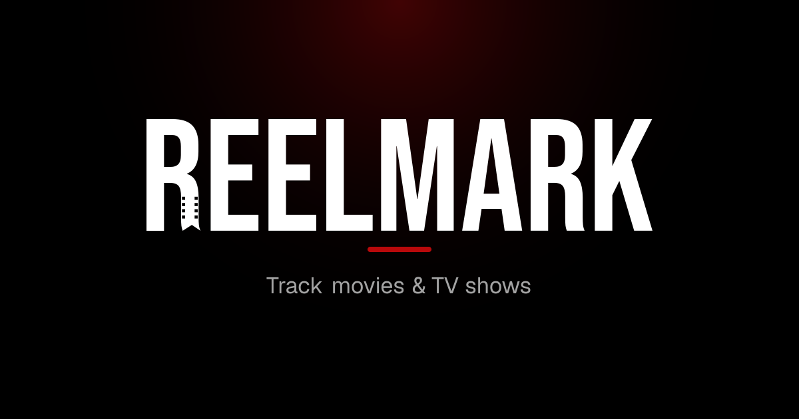
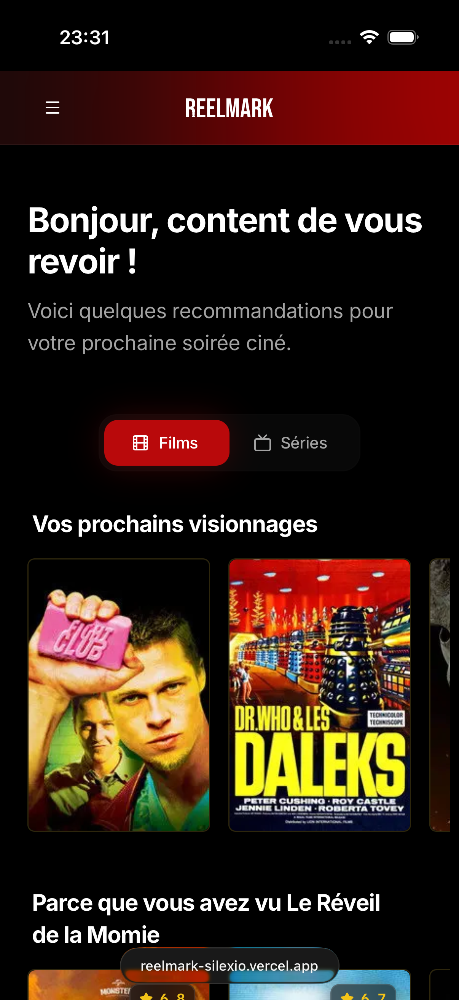
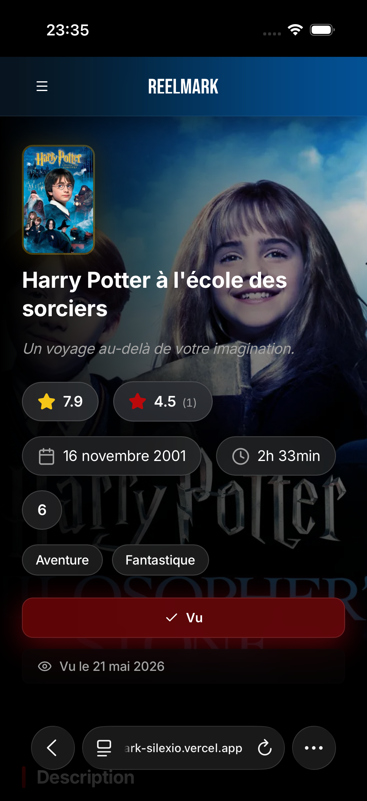
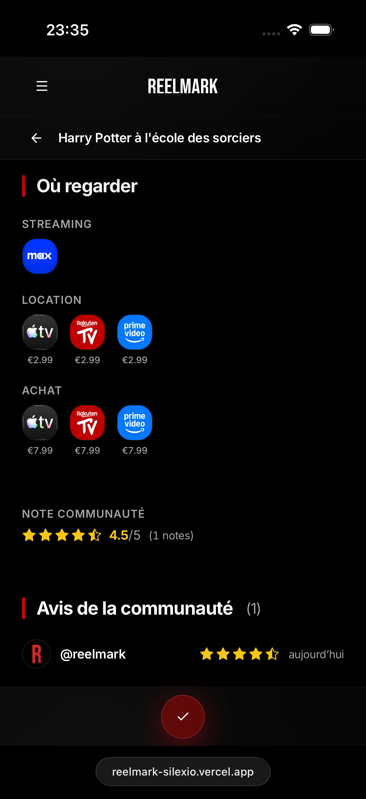

  

  
  
  
  
  

<h3 align="center">Never ask “which episode were we on?” again.</h3>

  A cinema-themed tracker for the movies and shows you watch — episode by episode, 
  with your ratings, your playlists and your friends. Installs like a native app.

  <strong><a href="https://reelmark.silexio.be">Open ReelMark →</a></strong>

  <strong><a href="#-english">🇬🇧 English</a> · <a href="#-français">🇫🇷 Français</a></strong>

---

## 🇬🇧 English

  
  
  

### What you get

|     |                                      |                                                                                                                                         |
| --- | ------------------------------------ | --------------------------------------------------------------------------------------------------------------------------------------- |
| 📺  | **Episode-level tracking**           | Tick episodes one by one, season by season. Your progress follows you everywhere, and the next episode to watch is always one tap away. |
| 🎬  | **A catalogue that knows what's on** | Browse what is actually in theatres near you, what is coming, and what is trending — filtered for your region, not someone else's.      |
| ⭐  | **Your ratings, your words**         | Rate from 1 to 10 and write reviews. See what the community thought before you press play.                                              |
| 📡  | **Where to watch it**                | See which of_your_ streaming services carries a title, plus rental and purchase prices, before you go looking.                          |
| 📁  | **Playlists**                        | Group titles into themed collections and share them with a link.                                                                        |
| 👥  | **Friends**                          | Follow what people you know are watching, reviewing and adding.                                                                         |
| 🔒  | **Privacy you control**              | Every section — watchlist, watched, reviews, playlists, friends — is public, friends-only or private. Your call, per section.           |
| 🌍  | **Bilingual**                        | Full English and French, switched instantly.                                                                                            |

### Install it

ReelMark is a PWA: no app store, no download, and it updates itself.

| Device                    | How                                                                                                    |
| :------------------------ | :----------------------------------------------------------------------------------------------------- |
| **iPhone / iPad**         | Open [reelmark.silexio.be](https://reelmark.silexio.be) in Safari → **Share** → **Add to Home Screen** |
| **Android**               | Open in Chrome → menu **⋮** → **Install app**                                                          |
| **Mac / Windows / Linux** | Open in Chrome or Edge → install icon in the address bar                                               |

Once installed it runs full-screen, keeps working offline for pages you have already visited, and can send you notifications.

### Good to know

- Your watch history is yours. Nothing is sold, and nothing is shared beyond the visibility you set.
- Film and TV data comes from [TMDB](https://www.themoviedb.org/); streaming availability from [Watchmode](https://api.watchmode.com).
- Found a bug or want a feature? [Open an issue](https://github.com/TheSawkit/ReelMark/issues).

---

## 🇫🇷 Français

### Ce que ça vous apporte

|     |                                        |                                                                                                                                                      |
| --- | -------------------------------------- | ---------------------------------------------------------------------------------------------------------------------------------------------------- |
| 📺  | **Suivi épisode par épisode**          | Cochez vos épisodes un à un, saison après saison. Votre progression vous suit partout, et le prochain épisode à voir est toujours à portée de pouce. |
| 🎬  | **Un catalogue qui sait ce qui passe** | Ce qui est vraiment à l'affiche près de chez vous, ce qui arrive, ce qui monte — filtré pour votre région, pas celle d'un autre.                     |
| ⭐  | **Vos notes, vos mots**                | Notez de 1 à 10 et écrivez vos critiques. Voyez ce qu'en a pensé la communauté avant de lancer.                                                      |
| 📡  | **Où le regarder**                     | Sachez lesquels de_vos_ services de streaming l'ont, et à quel prix en location ou achat, avant de chercher.                                         |
| 📁  | **Playlists**                          | Regroupez des titres en collections thématiques et partagez-les par lien.                                                                            |
| 👥  | **Amis**                               | Suivez ce que vos proches regardent, notent et ajoutent.                                                                                             |
| 🔒  | **Confidentialité maîtrisée**          | Chaque section — à voir, vu, critiques, playlists, amis — est publique, réservée aux amis ou privée. Vous décidez, section par section.              |
| 🌍  | **Bilingue**                           | Français et anglais complets, bascule instantanée.                                                                                                   |

### L'installer

ReelMark est une PWA : pas de store, pas de téléchargement, et elle se met à jour toute seule.

| Appareil                  | Comment                                                                                                         |
| :------------------------ | :-------------------------------------------------------------------------------------------------------------- |
| **iPhone / iPad**         | Ouvrez[reelmark.silexio.be](https://reelmark.silexio.be) dans Safari → **Partager** → **Sur l'écran d'accueil** |
| **Android**               | Ouvrez dans Chrome → menu**⋮** → **Installer l'application**                                                    |
| **Mac / Windows / Linux** | Ouvrez dans Chrome ou Edge → icône d'installation dans la barre d'adresse                                       |

Une fois installée, elle s'affiche en plein écran, reste consultable hors ligne sur les pages déjà visitées, et peut vous envoyer des notifications.

### Bon à savoir

- Votre historique vous appartient. Rien n'est vendu, rien n'est partagé au-delà de la visibilité que vous fixez.
- Les données films et séries viennent de [TMDB](https://www.themoviedb.org/), la disponibilité en streaming de [Watchmode](https://api.watchmode.com).
- Un bug, une idée ? [Ouvrez une issue](https://github.com/TheSawkit/ReelMark/issues).

---

## For developers

The technical README — stack, prerequisites, quick start, scripts, project structure,
configuration and deployment — moved to **[docs/DEVELOPMENT.md](./docs/DEVELOPMENT.md)**.

|                                              |                                                            |
| :------------------------------------------- | :--------------------------------------------------------- |
| [docs/DEVELOPMENT.md](./docs/DEVELOPMENT.md) | Setup, scripts, structure, configuration                   |
| [docs/](./docs/README.md)                    | Architecture · setup from scratch · data model · debugging |
| [DEPLOYMENT.md](./DEPLOYMENT.md)             | Kubernetes runbook (Infomaniak + Cloudflare)               |
| [CONTRIBUTING.md](./CONTRIBUTING.md)         | Branches, commit convention, PR process                    |
| [SECURITY.md](./SECURITY.md)                 | Security policy and vulnerability reporting                |

---

  This product uses the TMDB API but is not endorsed or certified by TMDB. 
  Posters, images and metadata belong to their respective rights holders.

  No open-source license — all rights reserved © SAWKIT. Contact the author for reuse.

  Built with 🍿 by <a href="https://github.com/TheSawkit">SAWKIT</a>

